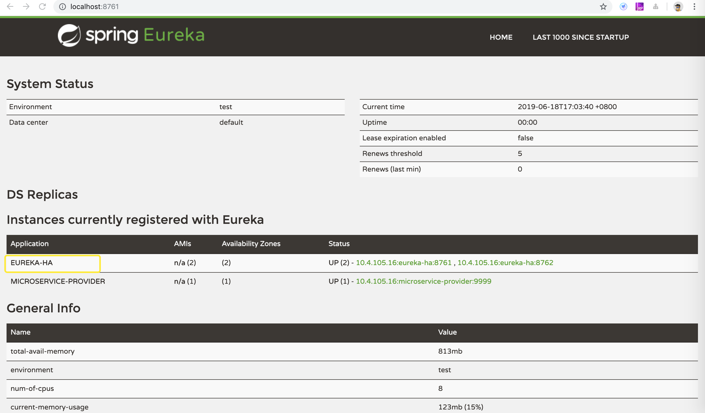

# eureka
注册中心

# 端口
8762

# 访问
http://localhost:8762/
http://localhost:8761/

# 集群
## 启动
按照spring的profile方式分别启动

```
java -jar target/eureka-1.0-SNAPSHOT.jar --spring.profiles.active=peer1
java -jar target/eureka-1.0-SNAPSHOT.jar --spring.profiles.active=peer2
```



注意：

> 1.如果使用集群的配置方式，则IDE中无法启动该项目
> 
> 2.如果访问其中http://localhost:8762/或者http://localhost:8761/并没有看到上图中的显示结果，则需要重启该Eureka Server进行尝试。